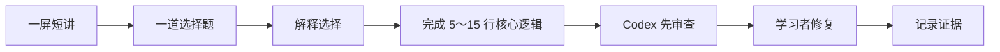

# LLM 后训练学习首页

## 当前只做一件事

确认 Qwen3.5-0.8B 单样本 LoRA 单步 GPU optimizer smoke 的配置、预算与授权。

> [!warning] 证据边界
> tokenizer/assistant mask 检查已经通过，但真实 Qwen backward、optimizer step 和训练效果均未执行。

## 今天的入口

1. [[notes/C00_loss_mask|C00：工具 SFT 的输入与监督区域]]
2. [[PROGRESS|学习进度与实验事实]]

## 已有材料

- [[notes/C00_map|后训练方法地图]]
- [[reports/environment|本地环境报告]]
- [[reports/model_selection_and_memory|模型选择与显存记录]]
- [[reviews/2026-09-14_C00_eval-metrics|最近一次 C00 评测审查]]

## 本次学习循环

完成当前目标前，不展开真实 GPU 训练或后续章节。
