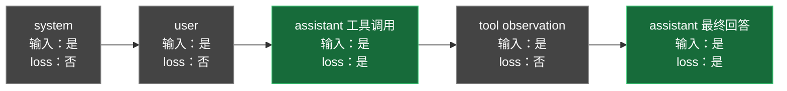

# C00：工具 SFT 的输入与监督区域

## 一句话结论

工具 SFT 中，整条轨迹都可以作为模型的输入上下文，但本项目只监督 assistant 生成的工具调用和最终回答；system、user、tool observation 的 label 设为 `-100`。



## 为什么 tool observation 不算 loss

`tool` 返回值由外部环境产生，不是模型动作。它必须留在 `input_ids` 中，因为模型需要读取它才能生成下一步；但它不应成为预测目标，否则训练会鼓励模型模仿甚至编造工具结果。

## 本机实际检查结果

固定模型：`Qwen/Qwen3.5-0.8B@2fc0636…`；本地 TRL：`1.13.0`。

TRL 检测到原始模型模板缺少 generation markers 后，实际选择了 Qwen3.5 training template：

| token 范围 | 内容 | assistant mask | labels |
|---|---|---:|---|
| 0～22 | system、user、assistant 起始标记 | 0 | `-100` |
| 23～53 | assistant 工具调用 | 1 | 等于对应 `input_ids` |
| 54～77 | tool response、下一 assistant 起始标记 | 0 | `-100` |
| 78～96 | assistant 最终答案 | 1 | 等于对应 `input_ids` |

共 97 个 token，50 个参与监督。这里的 assistant 起始标记在 `` 之外，所以也不参与 loss；assistant 内容和回合结束标记在监督区内。

> [!important] Shift 与 mask 是两件事
> `labels[i] == -100` 决定该目标位置是否计入 loss；因果语言模型内部再用较早位置的 logits 预测下一 token。不要手工把 labels 再右移一次。

## 本轮选择题

轨迹为：

1. `user`：查询订单 99
2. `assistant`：调用 `get_order(id=99)`
3. `tool`：返回“订单不存在”
4. `assistant`：订单 99 不存在

在本项目的默认规则下，哪些内容参与 SFT loss？

- A. user 问题、两段 assistant
- B. assistant 工具调用、assistant 最终回答
- C. tool 错误返回、assistant 最终回答
- D. 除 system 外的全部内容

先在对话中选择，不要修改笔记。选择后再进入最小代码作业。

## 最小代码作业

打开 [[scripts/inspect_tokens.py]]，只完成两个函数：

1. `build_labels`：assistant mask 为 1 时保留对应 token ID，否则写 `-100`。
2. `validate_labels`：检查长度一致、0/1 两种 mask 都存在、至少一个有效 label，以及每个位置符合上述规则。

不要改样本、模板调用或输出代码。完成后运行：

```bash
cd /mnt/d/llm-posttraining-lab
source scripts/env.sh
export HF_HUB_OFFLINE=1 TRANSFORMERS_OFFLINE=1
python scripts/inspect_tokens.py
```

首次从 D 盘导入环境可能需要约两分钟；它只加载 tokenizer/processor，不加载模型权重，不使用 GPU。

## 精确来源，需要时再展开

- [[LEARNING_PLAN#C03｜Tool-use SFT：先把训练做正确|主计划的 Tool-use SFT mask 规则]]
- 本地实现：`.venv/lib/python3.12/site-packages/trl/chat_templates/qwen3_5_nothink_training.jinja` 第 96～147 行。
- 本地处理链路：`.venv/lib/python3.12/site-packages/trl/trainer/sft_trainer.py` 第 1245～1264、1520～1618 行。
